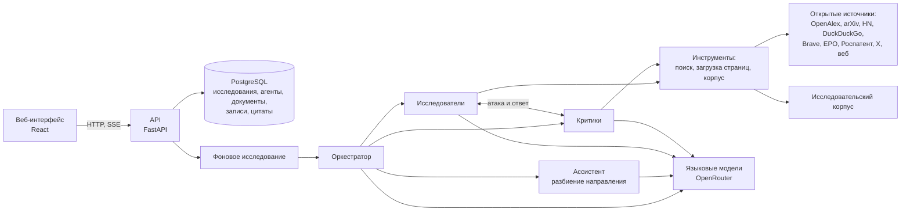
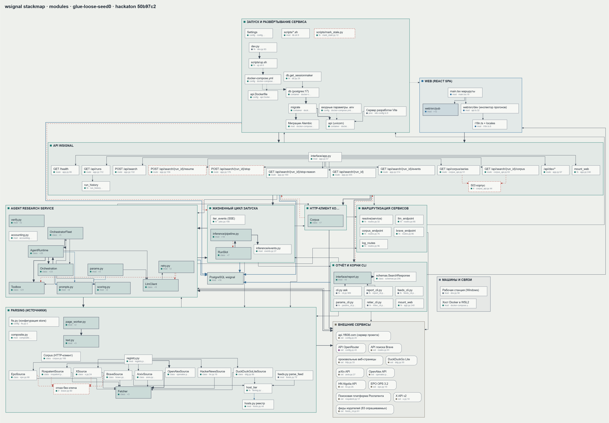

# Пайплайн обработки данных и архитектура

Как запрос превращается в отчёт: кто что делает, откуда берутся данные, как они
проверяются и хранятся, что делает система при сбоях. Что считается слабым сигналом и
как считается оценка, описано в [METHODOLOGY.md](METHODOLOGY.md).

## Компоненты

Сбор, инференс и интерфейс разделены по пакетам: `src/wsignal/parsing/`,
`src/wsignal/inference/`, `src/wsignal/interface/`. В Docker это три сервиса: `db`
(PostgreSQL 17), `migrate` (миграции Alembic, одноразово) и `api` (FastAPI и собранный
интерфейс на одном порту).

Подробная схема, извлечённая из кода (модули, функции, таблицы, внешние сервисы и связи между
ними):

Интерактивная версия находится в [architecture.html](architecture.html): откройте файл в браузере (скачайте
его из репозитория). В ней три уровня детализации (системы, модули, блоки), поиск по блокам,
подсветка основного пути запроса («Trace»), схема базы данных (вкладка «Data») и экспорт в PNG/SVG.
Язык переключается кнопками EN/RU.

## Этапы исследования

1. **Запуск.** `POST /api/search` создаёт исследование и сразу возвращает его номер; работа идёт
   фоном, события уходят в интерфейс потоком (SSE). Перед первым вызовом моделей
   опрашиваются провайдеры, и за каждой моделью закрепляется ответивший.
2. **Разбиение направления.** Оркестратор просит ассистента разбить запрос на поля
   (до 30). Ассистент сначала смотрит исследовательский корпус, затем веб, и обосновывает
   каждое поле найденным. Все поля сохраняются; оркестратор выбирает в пределах
   глубины исследования те, что дают разнообразие областей и типов признаков. Большое исследование
   делится на шарды по 10 полей со своим оркестратором на каждый.
3. **Исследование полей.** На каждое выбранное поле назначается исследователь. Он ищет, читает и ищет
   снова: каждый результат формирует следующий запрос. Итогом становится структурированная сдача:
   утверждение (технология и переход одним фальсифицируемым предложением), оценки
   реальности, динамики и незаметности с обоснованием, сработавшие признаки со ссылкой
   и дословной цитатой, разрыв между объявленным и работающим, масштаб относительно отрасли, что
   опровергло бы вывод, и журнал запросов.
4. **Опровержение.** На каждую сдачу, включая «шум», запускается критик. Он получает
   текст исследователя дословно и для каждого утверждения пытается доказать противоположное:
   что тема уже признана (незаметность ложна), что за ней ничего реального нет, что «три
   раунда» оказываются одним раундом в трёх изданиях. И наоборот: для «шума» ищет
   пропущенные деньги и участников. Исследователь отвечает на каждую атаку и может
   изменить свои оценки. Исследователи и критики работают параллельно.
5. **Запись.** Оркестратор читает обе стороны и записывает результат по всему
   исследованному, включая шум. Он ставит три числа и силу признаков, пишет
   обоснование и поля отчёта по-русски и переносит цитаты; итоговый балл и класс
   считает код. Две записи об одной технологии допустимы только для разных переходов.
6. **Проверка цитат.** Каждая цитата сверяется с сохранённым текстом своего источника:
   фрагменты по порядку и со сходством не ниже 90%, числа дословно. Результат
   проверки показывается у каждой цитаты.
7. **Отчёт.** Записи ранжируются по силе слабого сигнала; зрелые и шумовые идут в
   отдельный список с причиной. К каждой записи строится помесячный ряд упоминаний в
   корпусе по запросу, который сформулировал оркестратор.

Вся переписка работает по принципу «одна сторона утверждает, другая опровергает, третья
решает», и ни одно утверждение не попадает в отчёт без попытки его опровергнуть.

## Источники и сбор данных

| Источник | Что даёт | Что означает дата |
|---|---|---|
| `discovery` | объединённый поиск: собственное хранилище документов, OpenAlex, Hacker News; результаты сливаются по рангу (RRF), у каждого отмечено, какие индексы его нашли | смешанная |
| `web_search` (Brave) | открытый веб без пересортировки; показывает, насколько широко тема уже обсуждается | нет |
| DuckDuckGo | бесплатный веб-поиск | нет |
| OpenAlex | научные публикации | дата публикации |
| arXiv | препринты | дата подачи |
| Hacker News | ранние обсуждения инженеров | дата поста |
| EPO, Роспатент | патенты | дата публикации |
| X | соцсеть: первичный индикатор, не единственное основание | дата поста |
| `fetch` | полный текст любой открытой страницы или PDF | из метаданных страницы, с источником даты |
| `corpus` | исследовательский корпус: поиск по статьям, помесячные счётчики, чтение статьи | дата публикации |

У каждой записи хранится тип даты: даты подачи, публикации и скачивания являются разными
величинами, и «первое упоминание» считается только по источникам с реальной глубиной
истории.

**Транспорт.** Все запросы идут через один HTTP-клиент с лимитом частоты на каждый
хост (например, для arXiv один запрос в 3 с, для Brave 1 в секунду), повторами с
экспоненциальной паузой, дедлайном на загрузку и пределом размера ответа (5 МБ).
Квоты платных источников считаются на агента и списываются только за оплаченные вызовы.

**Обработка страниц.** HTML и PDF превращаются в текст в отдельном процессе с
таймаутом 20 с: зависший разбор страницы убивается и не блокирует исследование. Из страницы
извлекаются заголовок, сайт, язык и дата публикации (с пометкой, откуда дата взята).
Документ сохраняется целиком, с хостом и уровнем доверия; агенты читают его частями по
20 000 символов, повторное скачивание в течение 30 дней берётся из хранилища.

**Знаменатели.** Каждая попытка поиска и загрузки записывается в `source_events`,
включая ошибки и число найденного. Поэтому «ничего не найдено» отличается от
«источник не ответил», а утверждение об отсутствии сопровождается числом запросов и
площадок.

## Исследовательский корпус и сервер проекта

Корпус содержит около 7,3 млн датированных статей отраслевой и технологической прессы за три
года, собранных и проиндексированных заранее. Он размещён на сервере проекта и
доступен сервису по HTTP (`src/wsignal/corpus.py`):

| Запрос | Ответ |
|---|---|
| `POST /v1/corpus/search` | до 25 статей по запросу с фильтрами по дате и языку: заголовок, издание, дата, фрагмент; число совпадений (с ограничением сверху); копии одной статьи склеиваются, выдача распределяется по изданиям |
| `POST /v1/corpus/series` | помесячные счётчики совпадений и общего числа статей за окно (до 120 месяцев), признак «слишком общий запрос» |
| `GET /v1/corpus/article/{id}` | текст одной статьи с адресом и датой |

Прочитанная статья сохраняется в хранилище документов так же, как скачанная страница,
и цитируется с такой же проверкой. Тот же сервер передаёт вызовы моделей и веб-поиска
для развёртываний без своих ключей, ограничивая их списком разрешённых моделей и суточным
бюджетом (маршрутизация задана в `src/wsignal/routes.py`, настройка описана в README).

## Отказоустойчивость

- **Вызовы моделей** идут потоком. Если первый токен не пришёл за 30 с, провайдер
  отбрасывается и запрос уходит к другому; до четырёх попыток с паузой и общий дедлайн
  на вызов.
- **Каждый ход каждого агента записывается в базу сразу.** Это и протокол, и точка
  восстановления: прерванное исследование продолжается с того же места («↻ Продолжить» или
  `ask --resume`), без повтора сделанного.
- **Сердцебиение исследования.** Живое исследование отмечается каждые несколько секунд; если
  процесс умер, при следующем старте исследование помечается прерванным и доступно для
  продолжения.
- **Бюджеты.** Потолок стоимости исследования, предел шагов на агента и предел вызовов
  оркестратора; повторяющийся одинаковый вызов инструмента отклоняется, чтобы
  агент не зациклился.
- **Сбой источника не считается отсутствием данных.** Агент получает явную ошибку с причиной
  (нет ключа, таймаут, защита от ботов) и переходит на другие источники; ошибки видны
  на странице исследования в `/dev` (вкладка «Ошибки»).
- **Остановка и продолжение** доступны из интерфейса в любой момент.

## Хранение (PostgreSQL)

| Таблица | Что хранит |
|---|---|
| `runs` | исследование: запрос, состояние, лимиты, сердцебиение |
| `fields`, `field_renames` | поля разбиения и их переименования с причиной |
| `agents`, `turns` | агенты и каждый их ход: сообщение, вызовы инструментов, модель, провайдер, токены, стоимость |
| `documents` | скачанные документы: текст, хост, дата и её источник, язык, уровень доверия |
| `technologies`, `aliases` | справочник технологий и синонимов (связывает записи разных исследований) |
| `entries`, `entry_patterns` | записи отчёта с оценками и сработавшими признаками |
| `citations` | цитаты, их документ и результат проверки |
| `refutations` | атаки критика и ответы исследователя |
| `source_events` | каждый поиск и каждая загрузка, включая неудачные |
| `run_events` | события исследования для хроники и потока в интерфейс |

Схема меняется только миграциями Alembic (`migrations/`), которые применяет сервис
`migrate` при каждом запуске.

## Модели и журналирование

Модель задана на роль (оркестратор, ассистент, исследователь, критик, экстрактор), автоматического
выбора модели нет. Каждый вызов сохраняется с фактической моделью, провайдером,
идентификатором генерации, длительностью, числом попыток, токенами и стоимостью; модели
исследования перечислены в отчёте. Промпты ролей хранятся файлами в `prompts/`; общая часть
(`prompts/shared.md`) содержит методологию в сжатом виде.

## Отбор признаков

Признаки (типы незаметности и реальности из [методологии](METHODOLOGY.md)) отобраны
по обоснованиям самих методологов: колонка «Почему это слабый сигнал» прочитана для
всех 100 строк, повторяющиеся аргументы сгруппированы, и для каждой группы записано, чем
она измеряется и что её опровергает.

Поверхностные признаки мы проверили и отказались от них как основы оценки:

- 16 регулярных признаков по тексту строк срабатывали редко (11 из 16 встречались менее чем на
  10 строках); сильнейшую связь с баллом показал признак денег (r = 0,31, n = 42);
- 23 параметра, извлечённых моделью из строк, заполнили лишь 21% ячеек (в среднем 4,85 из
  23 на строку), а в повторном извлечении модель в 19% случаев расходилась сама с собой
  в том, ставить ли значение вообще;
- в повторяемой стратифицированной пятикратной кросс-валидации (40 повторов)
  эти параметры не превзошли базовую линию устойчиво.

Вывод: признак слабого сигнала состоит в отношении между двумя измерениями
(активностью и признанием) и отдельным словом в тексте не выражается. Это отношение
нужно найти во внешних источниках.
Поэтому система ищет типизированные доказательства в открытых источниках, оценивает
силу каждого с цитатой и подвергает опровержению, а итоговую оценку считает код по
прозрачной формуле. Интерпретируемость обеспечивается тем, что каждый признак, повлиявший на
оценку, виден в отчёте вместе со своей цитатой.
